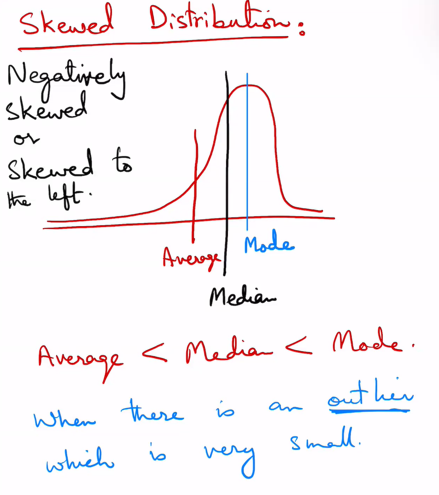
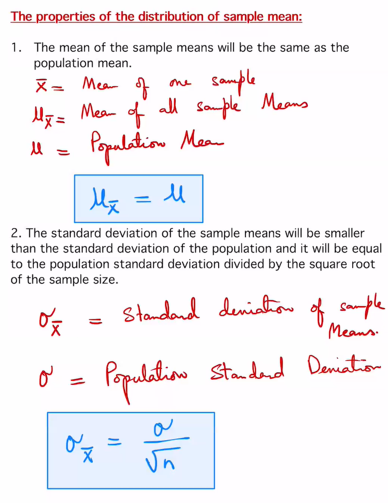
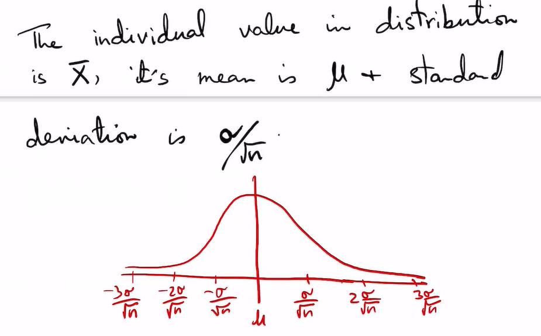
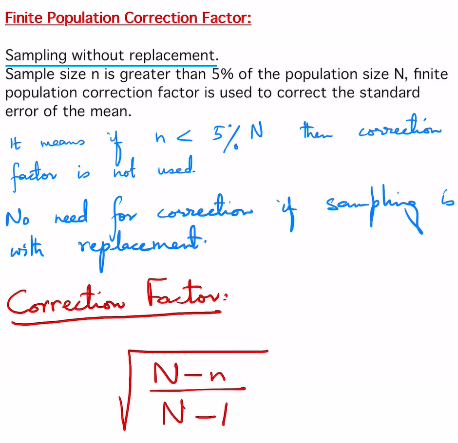
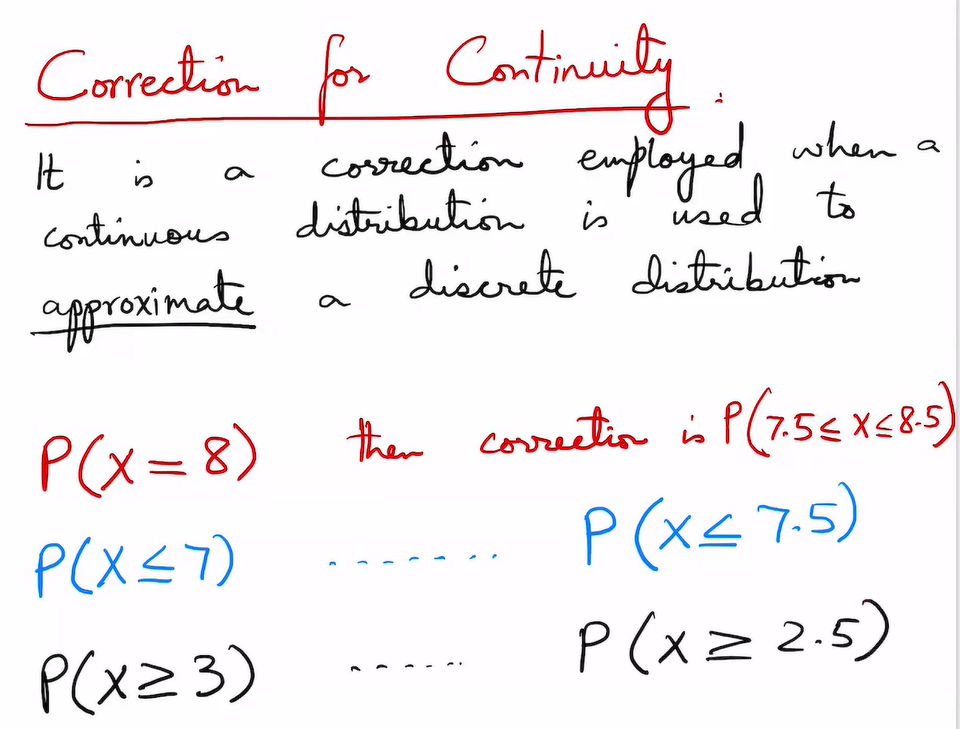
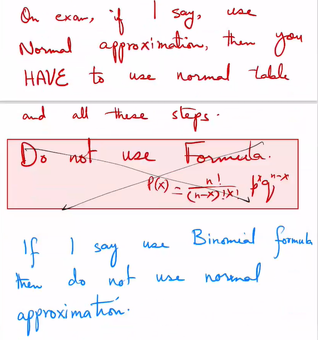

# Chapter 1: Distribution
> written by 20电美刘庆宇
```mermaid
graph LR
   AB1["Distribution"]
      AB1-->AB1C1["Probability Distribution"]
      AB1-->AB1C2["Binomial Distribution"]
      AB1-->AB1C3["Multinomial Distribution"]
      AB1-->AB1C4["Poisson Distribution"]
      AB1-->AB1C5["Normal Distribution"]
        AB1C5-->AB1C5D1["Population"]
        AB1C5-->AB1C5D2["Sampling with replacement
"]
        AB1C5-->AB1C5D3["Sampling without replacement
"]
```
## ① Probability Distribution
|要求|题目|
|-|-|
|求$\mu$|[C1Q1](../images/C1Q1.PNG)、[C1Q2](../images/C1Q1.PNG)、[C1Q3_1](../images/C1Q3_1.PNG)、[C1Q3_2](../images/C1Q3_2.PNG)|
|求$\mu,\,\sigma^2,\,\sigma$|[C1Q4](../images/C1Q4.PNG)、[C1Q5_1](../images/C1Q5_1.PNG)、[C1Q5_2](../images/C1Q5_2.PNG)、[C1Q6_1](../images/C1Q6_1.PNG)、[C1Q6_2](../images/C1Q6_2.PNG)|
|求$E(x)$|[C1Q7](../images/C1Q7.PNG)、[C1Q8](../images/C1Q8.PNG)、[C1Q9](../images/C1Q9.PNG)|
1. Probablity Distribution:
   
   |x|0|1|2|3|
   |-|-|-|-|-|
   |**P(x)**|||||
2. Mean(均值): $\mu = \sum{x\cdot P(x)}$
3. Variance(方差): $\sigma^2=\sum{x^2\cdot P(x)-\mu^2}$
4. Standard deviation(标准差): $\sigma=\sqrt{\sum{x^2\cdot P(x)-\mu^2}}$
5. Expected Value(数学期望): $E(x)=\mu = \sum{x\cdot P(x)}$
## ② Binomial Distribution
|要求|题目|
|-|-|
|求$P(x)$|[C1Q10](../images/C1Q10.PNG)、[C1Q11](../images/C1Q11.PNG)、[C1Q12_1](../images/C1Q12_1.PNG)、[C1Q12_2](../images/C1Q12_2.PNG)、[C1Q13_1](../images/C1Q13_1.PNG)、[C1Q13_2](../images/C1Q13_2.PNG)、[C1Q13_3](../images/C1Q13_3.PNG)、[C1Q14_1](../images/C1Q14_1.PNG)、[C1Q14_2](../images/C1Q14_2.PNG)|
|求$\mu,\,\sigma^2,\,\sigma$|[C1Q15](../images/C1Q15.PNG)、[C1Q16](../images/C1Q16.PNG)、[C1Q17](../images/C1Q17.PNG)|

1. p：成果概率；q：失败概率
   - $q = 1-p$
2. n: number of trials
3. X: number of successes
4. $P(x)=C_n^x \cdot p^x\cdot q^{n-x}= \displaystyle\frac{n!}{(n-x)!x!}\cdot p^x\cdot q^{n-x}$
5. Mean(均值): $\mu = np$
6. Variance(方差): $\sigma^2=npq$
7. Standard deviation(标准差): $\sigma=\sqrt{npq}$
## ③ Multinomial Distribution
|要求|题目|
|-|-|
|求$P(M)$|[C2Q1](../images/C2Q1.PNG)、[C2Q2](../images/C2Q1.PNG)、[C2Q3](../images/C2Q3.PNG)|
1. $P(M) = \displaystyle\frac{n!}{x_1!x_2!\cdots x_k!}P_1^{x_1}\cdot P_2^{x_2}\cdots P_k^{x_k}$
  
   $(x_1 + x_2 + \cdots + x_k = n)$
## ④ Poisson Distribution
|要求|题目|
|-|-|
|求$P(x, \lambda)$|[C2Q4](../images/C2Q4.PNG)、[C2Q5](../images/C2Q5.PNG)、[C2Q6_1](../images/C2Q6_1.PNG)、[C2Q6_2](../images/C2Q6_2.PNG)、[C2Q6_3](../images/C2Q6_3.PNG)|

N很大，p很小，变量在一段时间内发生

1. $P(x, \lambda) = \displaystyle\frac{e^{-\lambda}\cdot \lambda^x}{x!}$
   - $x = 1, 2, 3\cdots$
   - λ是单位时间(或单位面积)内随机事件的平均发生次数
     - 如果题目中$\lambda$未给出，使用公式$\lambda = np$
## ⑤ Normal Distribution
|要求|题目|
|-|-|
|根据$z$ 求概率|[C2Q7](../images/C2Q7.PNG)、[C2Q8](../images/C2Q8.PNG)、[C3Q1](../images/C3Q1.PNG)、[C3Q2](../images/C3Q2.PNG)、[C3Q3](../images/C3Q3.PNG)、[C3Q4](../images/C3Q4.PNG)、[C3Q5](../images/C3Q5.PNG)|
|正态分布应用(求p)|[C3Q6](../images/C3Q6.PNG)、[C3Q7_1](../images/C3Q7_1.PNG)、[C3Q7_2](../images/C3Q7_2.PNG)、[C3Q8_1](../images/C3Q8_1.PNG)、[C3Q8_2](../images/C3Q8_2.PNG)|
|正态分布应用(求x)|[C3Q9_1](../images/C3Q9_1.PNG)、[C3Q9_2](../images/C3Q9_2.PNG)、[C3Q10_1](../images/C3Q10_1.PNG)、[C3Q10_2](../images/C3Q10_2.PNG)|
1. 性质：
   > 1. 当$x=\mu$, 密度函数取得最大值
   > 
   > 2. $\sigma$越大，曲线越平坦
   - 均值，中位数和众数（mean, medeian and mode）相等
   - Symmetrical 对称
   - Continuous 连续
   - Unimodal 单峰
   - No touch the X-axis 不接触x轴
   - 36特性：
  
     
2. Skewed Distribution (偏态分布)
   1. Negatively skewed distribution (负偏态分布)
   
      
   2. Positively skewed distribution (正偏态分布)
   
      
3. Standard Normal Distribution (标准正态分布)
   
   $\mu = 0,\,\sigma = 1$
4. Z-table 标准正态分布表 (课本P227)
   - $z = \displaystyle\frac{x-\mu}{\sigma}$
   - $x = z\sigma+\mu$
   - 作用：把正态分布转换为标准正态分布

## ⑥ Sampling Distribution (采样分布)
|要求|题目|
|-|-|
|Sampling with replacement|[C3Q11](../images/C3Q11.PNG)、[C3Q12_1](../images/C3Q12_1.PNG)、[C3Q12_2](../images/C3Q12_2.PNG)|
|Sampling without replacement|[C3Q13_1](../images/C3Q13_1.PNG)、[C3Q13_2](../images/C3Q13_2.PNG)、[C3Q14_1](../images/C3Q14_1.PNG)、[C3Q14_2](../images/C3Q14_2.PNG)|
1. 样本均值分布性质：
   
   

   样本均值分布的性质:
   1. 样本均值等于总体均值样本均值等于总体均值。
   
      $\mu_{\bar{x}}=\mu$
   2. 样本均值的标准差小于总体标准差; 等于总体标准差除以样本容量的平方根。
      
      $\sigma_{\bar{x}}=\displaystyle\frac{\sigma}{\sqrt{n}}$
2. The standard deviation of sample means is called the standard error of the Means (SEM)
   > 样本均值的标准偏差称为均值的标准误差(SEM)。

   SEM=$\sigma_{\bar{x}}$
3. Central Limit Theory (中心极限定理):
   
   As the sample size n increases, the shape of the distribution of the sample means taken from a population with mean μ and stardard deviation σ will approach a normal distribution. This distribution will have a mean μ and a standard deviation$\displaystyle\frac{\sigma}{\sqrt{n}}$
   > 随着样本量n的增加，从均值为μ、标准差为σ的总体中得到的样本均值的分布形状将接近正态分布。这个分布将有一个平均值μ和一个标准差$\displaystyle\frac{\sigma}{\sqrt{n}}$
   
   Standard score for population: 
   
   $z = \displaystyle\frac{x-\mu}{\sigma}$
   
   Standard score for distribution of sample means: 
   
   $z = \displaystyle\frac{\bar{x}-\mu}{\sigma_{\bar{x}}} = \displaystyle\frac{\bar{x}-\mu}{\sigma/\sqrt{n}}$
   > $\bar{x}$: Sample mean
   > 
   > $\mu$: Population mean
   > 
   > $\sigma_{\bar{x}}$: Standard deviation of sample means
   > 
   > $n$: Sample size

    
4. Sampling without replacement (不重复抽样)
   
   
   
   - 当$n>N\cdot 5$%, 使用校正系数$\sqrt{\displaystyle\frac{N-n}{N-1}}$
   - Standard Error of Means:

     $\sigma_{\bar{x}}=\displaystyle\frac{\sigma}{\sqrt{n}}\cdot\sqrt{\displaystyle\frac{N-n}{N-1}}$
   - $z=\displaystyle\frac{\bar{x}-\mu}{\displaystyle\frac{\sigma}{\sqrt{n}}\cdot\sqrt{\displaystyle\frac{N-n}{N-1}}}$
  
   |Population|Sampling with replacement|Sampling without replacement|
   |-|-|-|
   |$z = \displaystyle\frac{x-\mu}{\sigma}$|$z =  \displaystyle\frac{\bar{x}-\mu}{\sigma/\sqrt{n}}$|$z=\displaystyle\frac{\bar{x}-\mu}{\displaystyle\frac{\sigma}{\sqrt{n}}\cdot\sqrt{\displaystyle\frac{N-n}{N-1}}}$|

   > On the exam, you will only think of this coreection if I mention **Sampling without replacement** or **finite population**. Otherwise assume sampling with replacement. 
   > 
   > 在考试中，只有当我提到 **Sampling without replacement** 或 **finite population**时，你才会想到这个correction。否则，假设 重复抽样。
## ⑥ The normal approximation to the binomial distribution (二项分布的正态近似)
|要求|题目|
|-|-|
|Normal approximation|[C3Q15_1](../images/C3Q15_1.PNG)、[C3Q15_2](../images/C3Q15_2.PNG)、[C3Q16_1](../images/C3Q16_1.PNG)、[C3Q16_2](../images/C3Q16_2.PNG)、[C3Q17_1](../images/C3Q17_1.PNG)、[C3Q17_2](../images/C3Q17_2.PNG)|

Procedure for the Normal Approximation to the Binomial Distribution:
1. Check if Normal Approximation can be used.
   - $np\geq5$ and $nq\geq5$
2. Find mean and standard deviation.
   - $\mu=np$, $\sigma=\sqrt{npq}$
3. Write P(X)
   - Example: P(x=8)
4. Rewrite using continuity correction factor and show area
   - Example: P(7.5 $\leq$ x $\leq$ 8.5)
5. Find z value.
   - $z=\displaystyle\frac{x-np}{\sqrt{npq}}$
6. Solve.
   - Caculate probability

