# Chapter 2: Hypothesis Testing
> written by 20电美刘庆宇
```mermaid
graph LR
   AB2["Hypothesis Testing"]
      AB2-->AB2C1["One population"]
      AB2-->AB2C2["Two population"]
      AB2-->AB2C3["P-value"]
```
## ① Hypothesis (假设)
|要求|题目|
|-|-|
|列出$H_0$、$H_1$|[C4Q1](../images/C4Q1.PNG)、[C4Q2](../images/C4Q2.PNG)、[C4Q3](../images/C4Q3.PNG)|
1. $H_0$: null hypothesis (零假设)就是没有显著差异
   - $H_0$是**被普遍接受**的，需要被挑战的结论。
2. $H_1$: alternative hypothesis (对立假设)是有显著差异
   - $H_1$是**希望证实**的假设。
3. Rules: **$H_1$ can't have equality, while $H_0$ has equality.（$H_0$能有等号, $H_1$不能有等号）** 
   > claim是$H_0$还是$H_1$取决于题目中的描述，如果题目描述是`There is no difference(=)`, 那claim是$H_0$; 如果题目描述是`There is difference(≠)`、`taller(>)`、`smaller(<)`, 则claim是$H_1$
## ② Statistical Test: One population (统计检验: 一个正态总体)
|要求|题目|
|-|-|
|已知$\alpha$, 求C.V|[C4Q4](../images/C4Q4.PNG)、[C5Q1](../images/C5Q1.PNG)、[C5Q2](../images/C5Q2.PNG)|
|$\sigma$ is known|[C4Q5_1](../images/C4Q5_1.PNG)、[C4Q5_2](../images/C4Q5_2.PNG)、[C4Q5_3](../images/C4Q5_3.PNG)、[C4Q5_4](../images/C4Q5_4.PNG)、[C4Q6_1](../images/C4Q6_1.PNG)、[C4Q6_2](../images/C4Q6_2.PNG)、[C4Q6_3](../images/C4Q6_3.PNG)、[C4Q7_1](../images/C4Q7_1.PNG)、[C4Q7_2](../images/C4Q7_2.PNG)、[C4Q7_3](../images/C4Q7_3.PNG)|
|$\sigma$ is unknown & $n>30$|None|
|$\sigma$ is unknown & $n<31$|[C5Q3_1](../images/C5Q3_1.PNG)、[C5Q3_2](../images/C5Q3_2.PNG)、[C5Q3_3](../images/C5Q3_3.PNG)、[C5Q4_1](../images/C5Q4_1.PNG)、[C5Q4_2](../images/C5Q4_2.PNG)、[C5Q4_3](../images/C5Q4_3.PNG)、[C5Q5_1](../images/C5Q5_1.PNG)、[C5Q5_2](../images/C5Q5_2.PNG)、[C5Q5_3](../images/C5Q5_3.PNG)|
|Proportions|[C5Q6_1](../images/C5Q6_1.PNG)、[C5Q6_2](../images/C5Q6_2.PNG)、[C5Q6_3](../images/C5Q6_3.PNG)、[C5Q7_1](../images/C5Q7_1.PNG)、[C5Q7_2](../images/C5Q7_2.PNG)、[C5Q7_3](../images/C5Q7_3.PNG)|
|Variance|[C8Q4_1](../images/C8Q4_1.PNG)、[C8Q4_2](../images/C8Q4_2.PNG)、[C8Q4_3](../images/C8Q4_3.PNG)、[C8Q5_1](../images/C8Q5_1.PNG)、[C8Q5_2](../images/C8Q5_2.PNG)、[C8Q5_3](../images/C8Q5_3.PNG)、[C8Q6_1](../images/C8Q6_1.PNG)、[C8Q6_2](../images/C8Q6_2.PNG)、[C8Q6_3](../images/C8Q6_3.PNG)|
|Correlation Coefficient|[C8Q1_1](../images/C8Q1_1.PNG)、[C8Q1_2](../images/C8Q1_2.PNG)、[C8Q2_1](../images/C8Q2_1.PNG)、[C8Q2_2](../images/C8Q2_2.PNG)、[C8Q2_3](../images/C8Q2_3.PNG)|
|t-test for the Correlation Coefficient|[C8Q3_1](../images/C8Q3_1.PNG)、[C8Q3_2](../images/C8Q3_2.PNG)、[C8Q3_3](../images/C8Q3_3.PNG)|
|Goodness for Fit|[C9Q1_1](../images/C9Q1_1.PNG)、[C9Q1_2](../images/C9Q1_2.PNG)、[C9Q1_3](../images/C9Q1_3.PNG)、[C9Q1_4](../images/C9Q1_4.PNG)、[C9Q2_1](../images/C9Q2_1.PNG)、[C9Q2_2](../images/C9Q2_2.PNG)、[C9Q2_3](../images/C9Q2_3.PNG)、[C9Q3_1](../images/C9Q3_1.PNG)、[C9Q3_2](../images/C9Q3_2.PNG)、[C9Q3_3](../images/C9Q3_3.PNG)|
> [统计检验参考](https://blog.csdn.net/qq_40932139/article/details/102881244/)
> 
> 假设检验的最终目的是：去伪存真
> 
> 那么它对应的两类错误是 弃真、存伪。
1. 统计检验定义：判断$H_0$是否被拒绝
   
   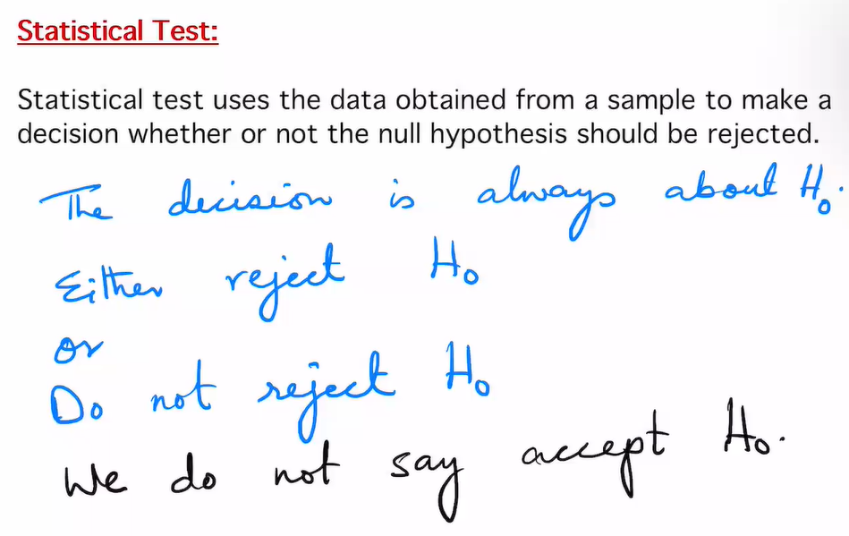

   Test value: 通过Statistical Test得到的数值
2. 两种Errors:
   1. Error I:Ⅰ型错误，拒绝了实际上成立的$H_0$，即错误地判为有差别。$\alpha$取0.05，表示当拒绝$H_0$时则理论上理论100次检验中平均有5次发生这样的错误。
   2. Error II: Ⅱ型错误，接受了实际上不成立的$H_0$，也就是错误地判为无差别。
   
   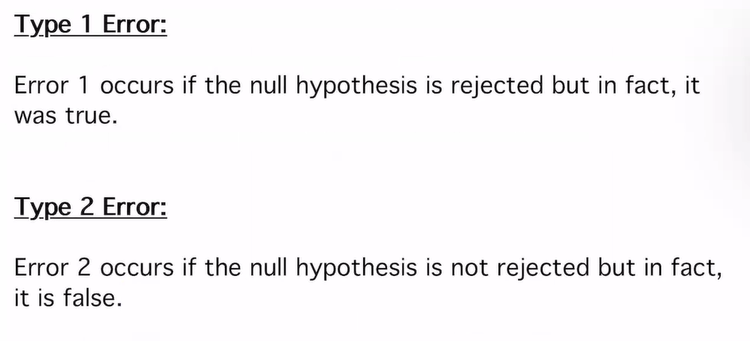
3. $\alpha$ (Level of Significance):是发生Error I的最大概率。
   - 常用的级别有0.05和0.01。
   - 如果$\alpha=0.05$，那么这意味着如果$H_0$被拒绝，那么Error I是5%; 做出正确决策的概率是95%。
4. Critical Value (C.V/临界值): 将关键区域与非关键区域分开。从表中选择“临界值”。
5. 3种Test:
   1. One tailed Left Test:
      
      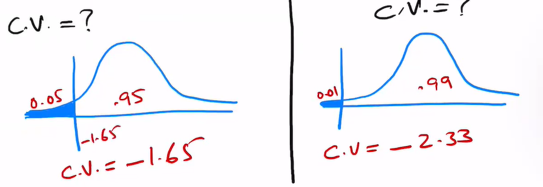
   2. One tailed Right Test:
      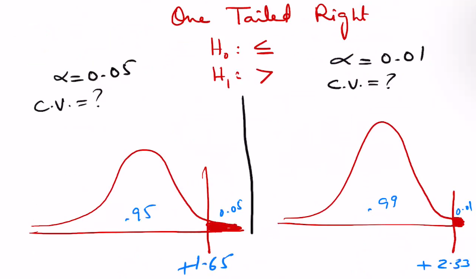
   3. Two tailed Test:
      
      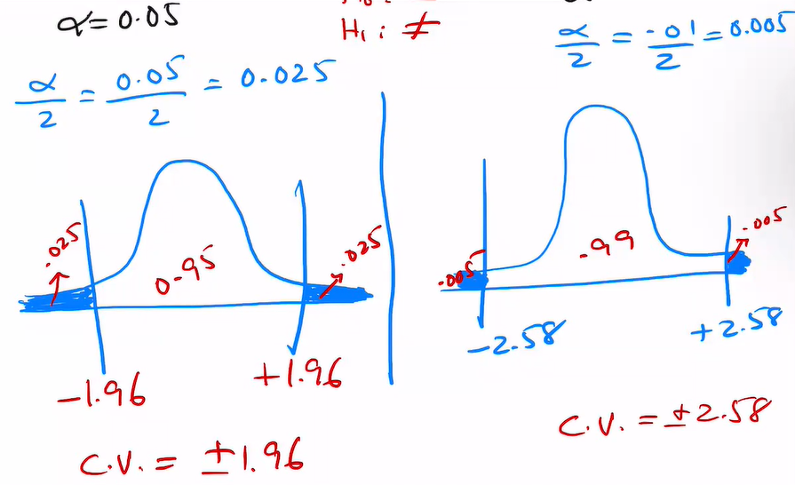
6. Procedure for Solving Hypothesis Testing Problems:
   1. State $H_0、H_1$
   2. Find the critical value
   3. Caculate the test value
   4. Make the decision about to reject or do not reject $H_0$
   5. Summarize the result in the conclusion
7. ${Test Value}=\displaystyle\frac{{observed value - expected value}}{{standard error}}=\displaystyle\frac{{sample - population parameter}}{{standard deviation}}$

    ||Formula|d.f.|Table type|
    |-|-|-|-|
    |$\sigma$ is known|$z=\displaystyle\frac{\bar{x}-\mu}{\sigma/\sqrt{n}}$|None|z-value + z-table|
    |$\sigma$ is unknown & $n>30$|$z=\displaystyle\frac{\bar{x}-\mu}{s/\sqrt{n}}$|None|z-value + z-table|
    |$\sigma$ is unknown & $n<31$|$t=\displaystyle\frac{\bar{x}-\mu}{s/\sqrt{n}}$|$d.f=n-1$|t-value + t-table|
    |Proportions|$z=\displaystyle\frac{\bar{x}-np}{\sqrt{npq}}$|None|z-value + z-table|
    |Variance|$\chi^2 = \displaystyle\frac{(n-1)s^2}{\sigma^2}$|$d.f = n-1$|$\chi^2$-value + $\chi^2$-table|
    |Goodness of Fit|$\chi^2=\sum\displaystyle\frac{(O-E)^2}{E}$|$d.f =$ number of categories minus 1|$\chi^2$-value + $\chi^2$-table|
    |Correlation Coefficient|$t = r\displaystyle\sqrt{\frac{n-2}{1-r^2}}$|$d.f = n-2$|t-value + t-table|
8. Chi-Squared (卡方分布 $\chi^2$)
   - One Tailed Left Test
  
     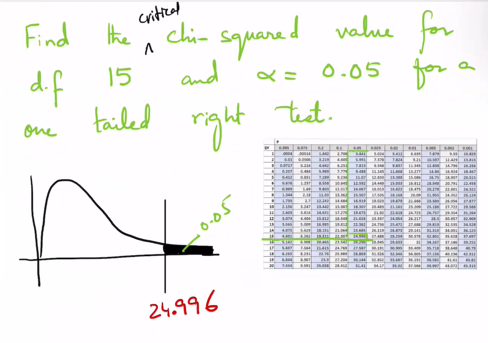
   - One Tailed Right Test

     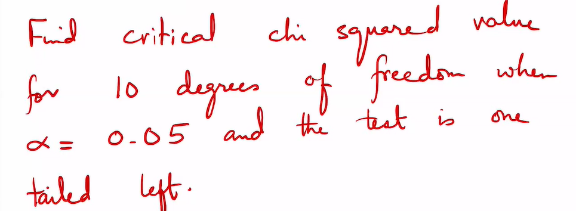
     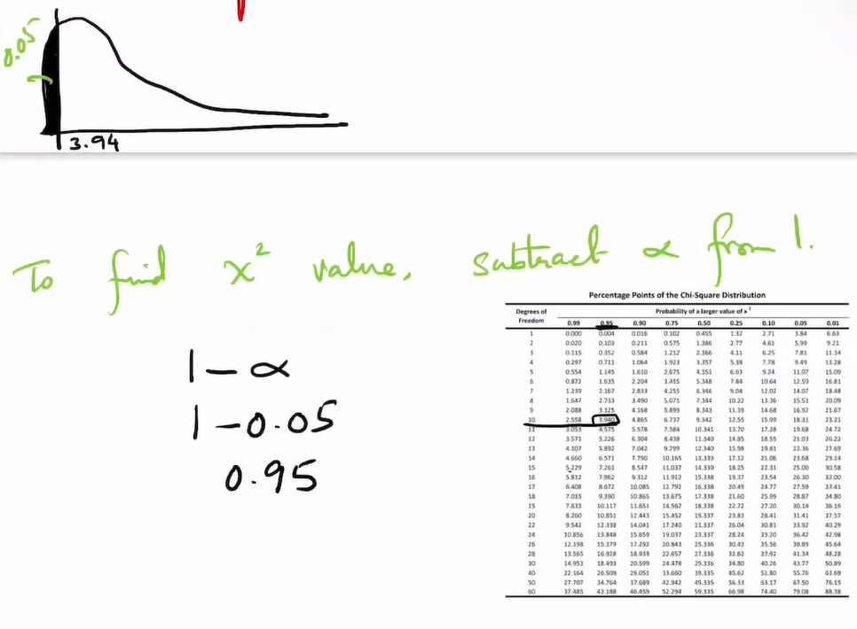
   - Two Tailed Test
  
     
     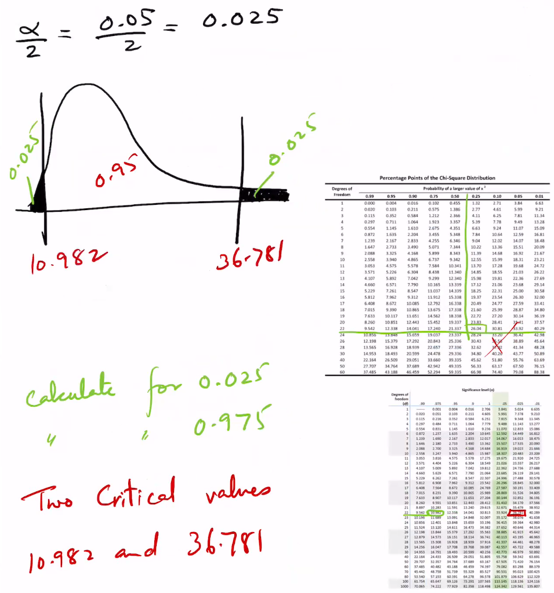
9. Correlation Coefficient:

   The correlation coeffcient measures the strength and direction of a relationship between two variables.

   The symbol for sample correlation coeffcient is $r$.
   
   The symbol for population correlation $\rho$
   - range:-1~1
  
     
   - Correlation Coefficient Formula: $$r = \displaystyle\frac{n(\sum xy)-(\sum x)(\sum y)}{\sqrt{[n(\sum x^2)-(\sum x)^2]\cdot[n(\sum y^2)-(\sum y)^2]}}$$
   - t-test for the Correlation Coefficient: $$t = r\displaystyle\sqrt{\frac{n-2}{1-r^2}}$$
     
     with $d.f = n-2$
   - Possible Relationships between Variables: When $H_0$ has been rejected for a specifc $\alpha$, any the following five possibilities can exist.
     - There is a direct cause and effect relationship between thevariables. (直接因果)
     - There is a reverse cause and effect relationship between thevariables. (反向因果)
     - The relationship between the variables may be caused by a third variable. (变量之间的关系可能是由第三个变量引起的。)
     - There may be complexity of interrelationships among manyvariables. (许多变量之间的相互关系可能是复杂的)
     - The relationship may be coincidental. (关系可能是巧合产生的)
10. Test of Goodness for Fit (拟合优度检验)
    - Formula: $$\chi^2=\sum\displaystyle\frac{(O-E)^2}{E}$$     
     
      with $d.f$ = number of categories minus 1
      - $O$: Observed frequency
      - $E$: Expected frequency
      > When a  specific ratio of frequencies is not given, assume equal distribution
    - The difference between the Test of Goodness for Fit and the Chi-Squared Variance test:
      - the Chi-Squared Variance test compares the sample variance with a hypothesized population variance. (卡方方差检验比较样本方差与假设的总体方差)
      - the Test of Goodness for Fit compares a distribution obtained from a sample with a hypothesized distribution. (拟合优度检验将从样本中得到的分布与假设分布进行比较。)

## ② Statistical Test: Two population (统计检验: 两个正态总体)
|要求|题目|
|-|-|
|$\sigma_1、\sigma_2$ are known|[C5Q9_1](../images/C5Q9_1.PNG)、[C5Q9_2](../images/C5Q9_2.PNG)、[C5Q9_3](../images/C5Q9_3.PNG)、[C5Q9_4](../images/C5Q9_4.PNG)|
|$\sigma_1、\sigma_2$ are unknown & $n_1>30,n_2>30$|[C5Q10_1](../images/C5Q10_1.PNG)、[C5Q10_2](../images/C5Q10_2.PNG)、[C5Q10_3](../images/C5Q10_3.PNG)|
|$\sigma_1、\sigma_2$ are unknown & $n_1<31,n_2<31$ & Variances unequal|[C5Q11_1](../images/C5Q11_1.PNG)、[C5Q11_2](../images/C5Q11_2.PNG)、[C5Q11_3](../images/C5Q11_3.PNG)|
|$\sigma_1、\sigma_2$ are unknown & $n_1<31,n_2<31$ & Variances equal|[C5Q12_1](../images/C5Q12_1.PNG)、[C5Q12_2](../images/C5Q12_2.PNG)、[C5Q12_3](../images/C5Q12_3.PNG)、[C5Q12_4](../images/C5Q12_4.PNG)|
|Propotions|[C6Q1_1](../images/C6Q1_1.PNG)、[C6Q1_2](../images/C6Q1_2.PNG)、[C6Q1_3](../images/C6Q1_3.PNG)、[C6Q2_1](../images/C6Q2_1.PNG)、[C6Q2_2](../images/C6Q2_2.PNG)、[C6Q2_3](../images/C6Q2_3.PNG)、[C6Q3_1](../images/C6Q3_1.PNG)、[C6Q3_2](../images/C6Q3_2.PNG)、[C6Q3_3](../images/C6Q3_3.PNG)|
1. Hypothesis (假设)
   > $H_1$不能有等号，但$H_0$能有等号
   
   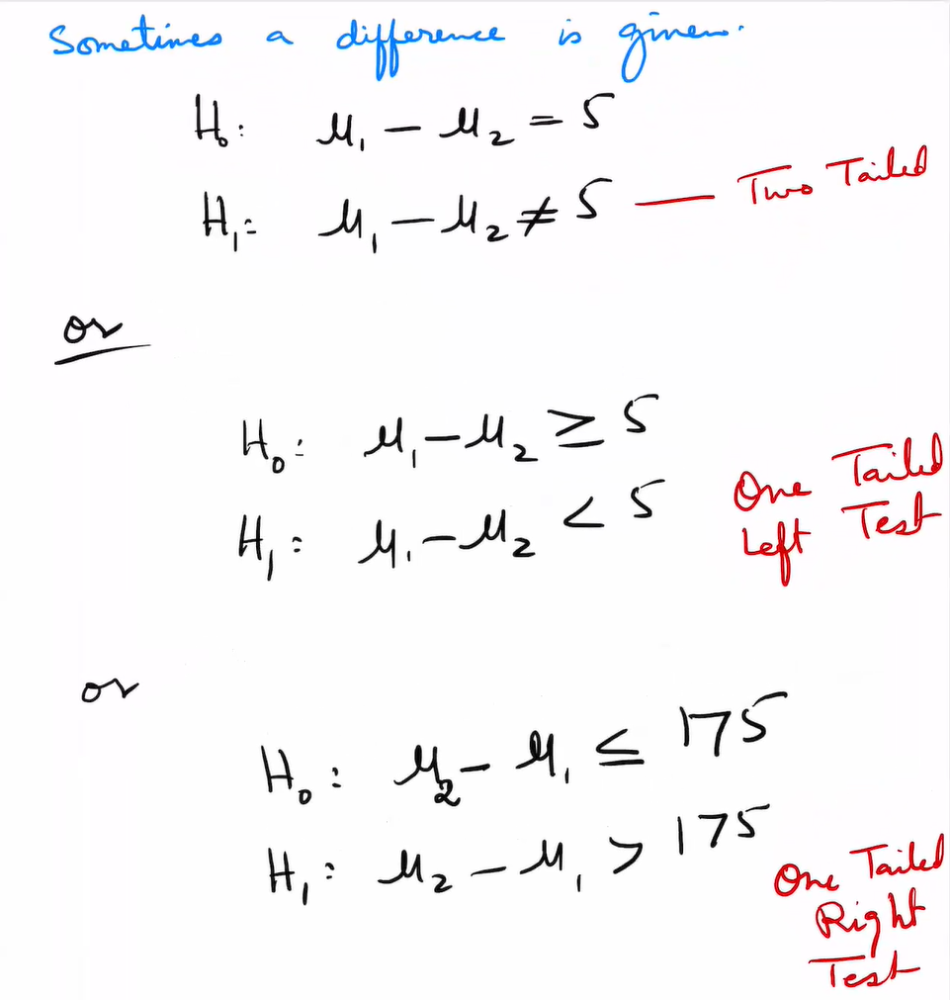
2. ${Test Value}=\displaystyle\frac{{observed value - expected value}}{{standard error}}=\displaystyle\frac{{sample - population parameter}}{{standard deviation}}$

    ||Formula|d.f.|Table type|
    |-|-|-|-|
    |$\sigma_1、\sigma_2$ are known|$z = \displaystyle\frac{(\bar{x}_1-\bar{x}_2)-(\mu_1-\mu_2)}{\sqrt{\displaystyle\frac{\sigma_1^2}{n_1}+\frac{\sigma_2^2}{n_2}}}$|None|z-value + z-table|
    |$\sigma_1、\sigma_2$ are unknown & $n_1>30,n_2>30$|$z = \displaystyle\frac{(\bar{x}_1-\bar{x}_2)-(\mu_1-\mu_2)}{\sqrt{\displaystyle\frac{s_1^2}{n_1}+\frac{s_2^2}{n_2}}}$|None|z-value + z-table|
    |$\sigma_1、\sigma_2$ are unknown & $n_1<31,n_2<31$ & Variances unequal|$t = \displaystyle\frac{(\bar{x}_1-\bar{x}_2)-(\mu_1-\mu_2)}{\sqrt{\displaystyle\frac{s_1^2}{n_1}+\frac{s_2^2}{n_2}}}$|$d.f={min}\{n_1-1,n_2-1\}$|t-value + t-table|
    |$\sigma_1、\sigma_2$ are unknown & $n_1<31,n_2<31$ & Variances equal|$t = \displaystyle\frac{(\bar{x}_1-\bar{x}_2)-(\mu_1-\mu_2)}{\sqrt{\displaystyle\frac{(n_1-1)s_1^2+(n_2-1)s_2^2}{n_1+n_2-2}}\cdot\sqrt{\displaystyle\frac{1}{n_1}+\frac{1}{n_2}}}$|$d.f=n_1+n_2-2$|t-value + t-table|
    |Proportions|$z = \displaystyle\frac{(\hat{p}_1-\hat{p}_2)-(p_1-p_2)}{\sqrt{\bar{p}\cdot\bar{q}\cdot\left(\displaystyle\frac{1}{n_1}+\frac{1}{n_2}\right)}}$|None|z-value + z-table|

    Proportions：

    |Probability|Formula|
    |-|-|
    |$\bar{p}$|$\displaystyle\frac{x_1+x_2}{n_1+n_2}$|
    |$\bar{q}$|$1-\bar{p}$|
    |$\hat{p}_1$|$\displaystyle\frac{x_1}{n_1}$|
    |$\hat{p}_2$|$\displaystyle\frac{x_2}{n_2}$|
## ③ P-value
|要求|题目|
|-|-|
|P-value|[C5Q8_1](../images/C5Q8_1.PNG)、[C5Q8_2](../images/C5Q8_2.PNG)、[C5Q8_3](../images/C5Q8_3.PNG)|

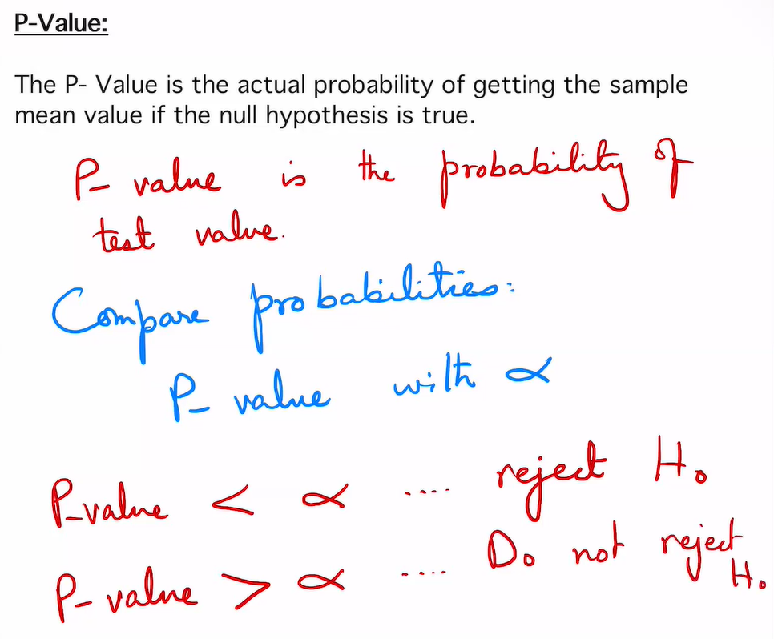
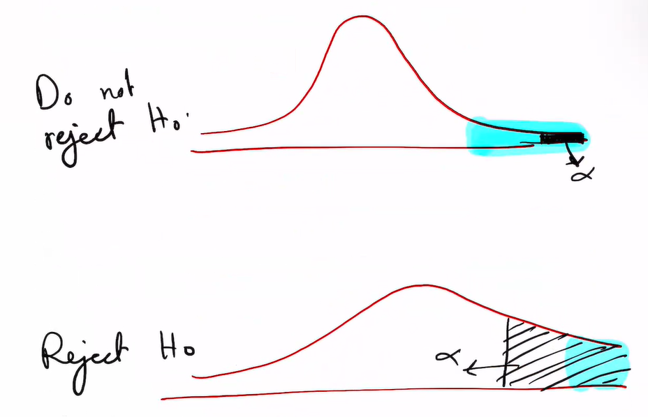

> Don't use P-value if the question doesn't ask for it. Use critical value. (如果题目中没有要求使用P-value，就不要使用P-value。使用C.V。)